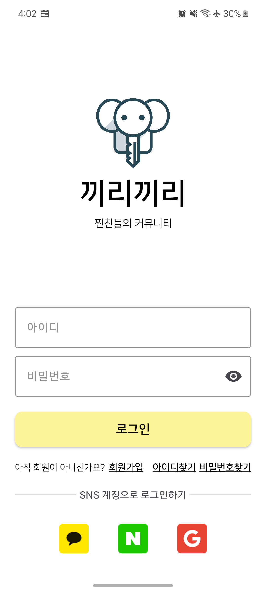
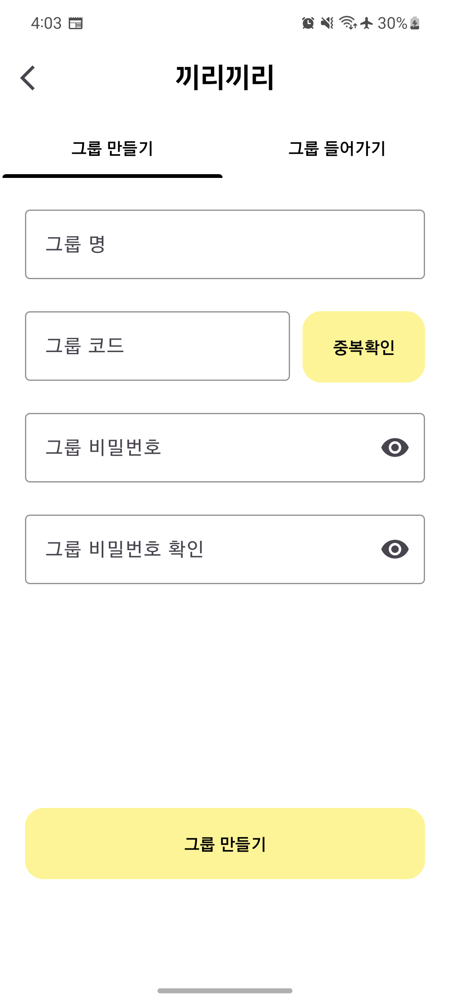
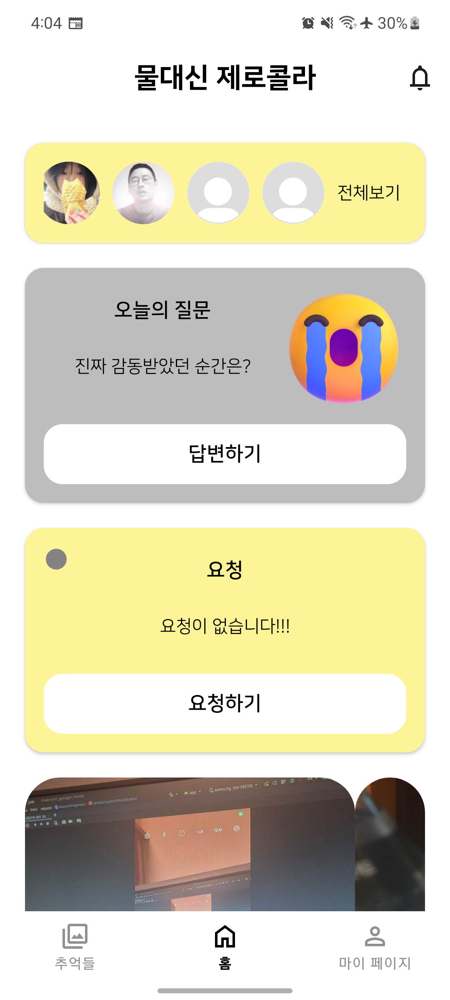
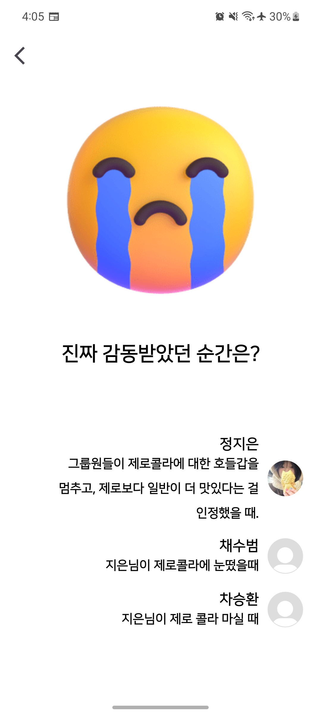
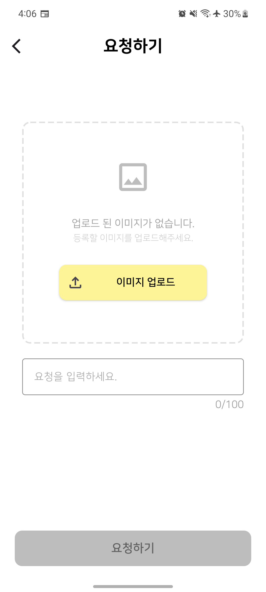
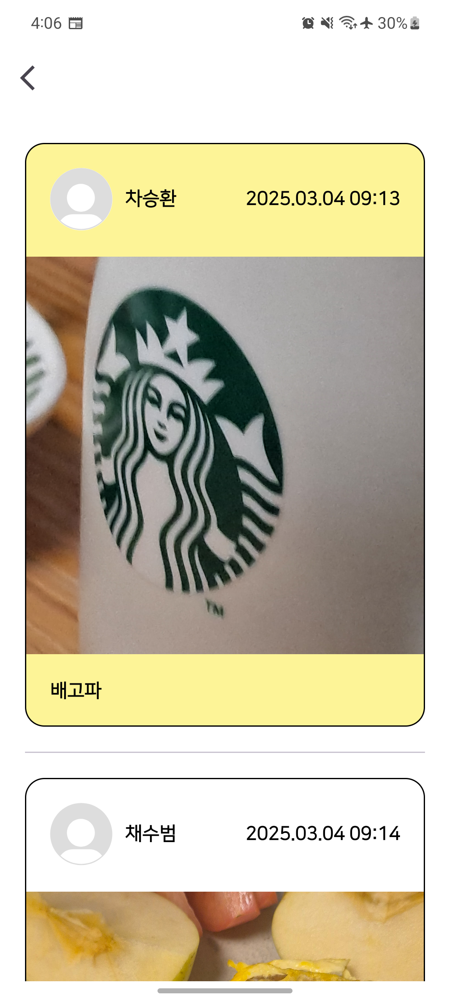
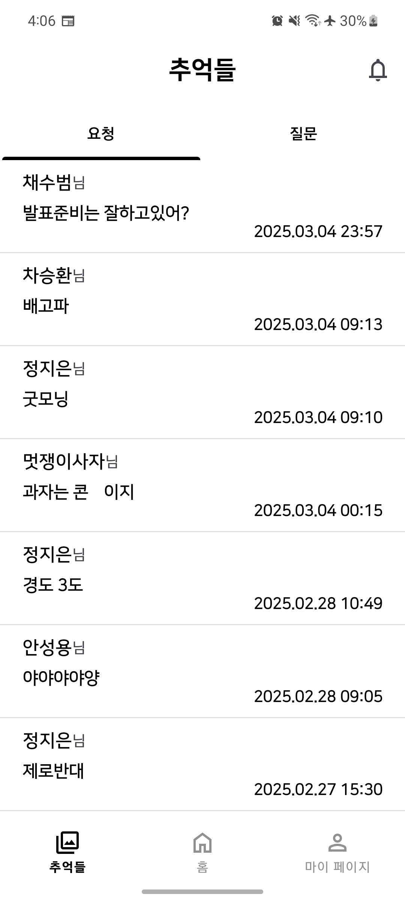
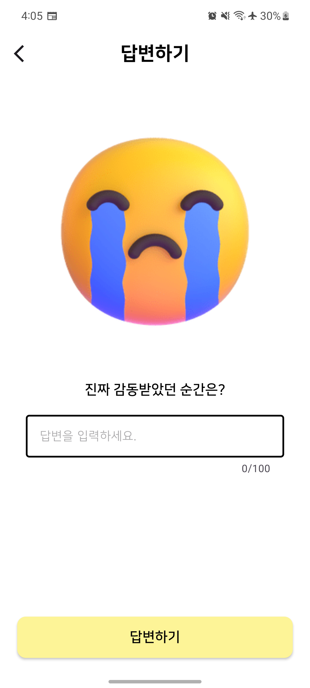
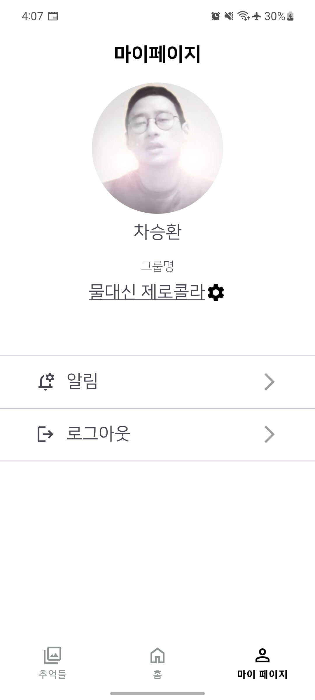
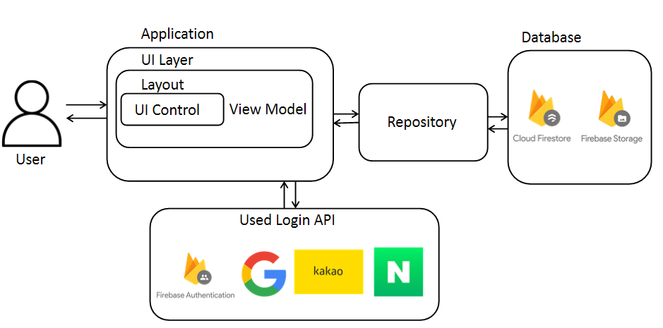

# 끼리끼리

> 멋쟁이 사자처럼 안드로이드 앱스쿨 3기 / 팀) friends
> 
> 
> 개발 기간 : 2025.02.06 ~ 2025.03.05
> 

## 🌟 배포 주소

> 요구사항 명세서                                                 
> https://docs.google.com/spreadsheets/d/1x4YWIlUO0vx7K2CE0nvun3ryrkuAntxt/edit?gid=1388090367#gid=1388090367
>
> 피그마
> https://www.figma.com/design/tRQobtFSTbqcQ2u8kLvNaI/%EC%95%B1%EC%8A%A4%EC%BF%A8_3%EA%B8%B0_%ED%8C%8C%EC%9D%B4%EB%84%90%ED%94%84%EB%A1%9C%EC%A0%9D%ED%8A%B8_1%ED%8C%80?node-id=846-4449&t=30lCzx21T06wlP7n-0
 

## 👨‍👩‍👧‍👦 팀 소개

| 안성용 | 차승환 | 정지은 | 채수범 |
| --- | --- | --- | --- |
|  |  |  |  |
| [네이버 바로가기](http://www.naver.com/) | [네이버 바로가기](http://www.naver.com/) | [네이버 바로가기](http://www.naver.com/) | [chaesoobum](https://github.com/chaesoobum) |

## 🔍 프로젝트 소개

> **"친한 친구들과 편하게 소통하고 싶지 않나요?"**
> 
> 
> 끼리끼리는 소중한 사람들과 비공개 그룹을 만들어 가볍고 의미 있는 대화를 나누는 일상 공유 플랫폼입니다.
> 
> 기존 SNS는 다수와의 소통을 강조해 불필요한 관계와 정보 피로감을 초래합니다. 이를 해결하기 위해, 우리는 제한된 관계와 시간 속에서 깊이 있는 대화를 유도하는 SNS를 기획했습니다.
> 
> 끼리끼리에서는 그룹원들끼리 실시간으로 요청하고 응답하며, 30분 제한을 통해 즉각적인 소통을 유도합니다. 또한, 하루 한 개의 질문을 제공해 더욱 능동적인 대화를 나눌 수 있도록 설계했습니다.
>
> 

## 🐈기술 스택

### **Environment**

  


### Config


### Development

     


### Communication


## 📺 화면 구성

| 로그인 화면 | 그룹 화면 | 홈 화면 |
| --- | --- | --- |
|  |  |  |

| 오늘의 질문 화면 | 요청하기 화면 | 요청 보기 화면 |
| --- | --- | --- |
|  |  |  |

| 추억들 화면 | 질문 답변하기 화면 | 마이페이지 화면 |
| --- | --- | --- |
|  |  |  |

## 🔔 주요 기능

❗소셜 로그인

- 카카오, 네이버, 구글 계정으로 간편하게 계정을 생성하고 로그인할 수 있음
- 빠르고 편리한 앱 이용 가능

❗요청 및 응답

- 사용자는 그룹원들에게 사진과 간단한 코멘트를 요청할 수 있음
- 요청받은 그룹원은 사진과 함께 응답을 남길 수 있음
- 꾸며진 이미지보다 진짜 모습을 공유하는 데 초점을 맞춰 앨범 업로드를 제한하고, 카메라 촬영만 허용

❗질문 및 답변

- 매일 자정 모든 사용자들에게 하루 한 개의 질문을 제공하여 능동적인 참여 유도
- 질문에 답변한 사용자는 다른 그룹원들이 작성한 답변을 볼 수 있음

## 🏗️ **아키텍처**


📁 패키지 구조

```markdown
├── com.friends.ggiriggiri
│   │
│   ├── api
│   │
│   ├── util // 도구
│   │   └── tools
│   │
│   ├── data // 서버와 통신하는 부분
│   │   ├── model
│   │   ├── repository
│   │   ├── service
│   │   └── vo
│   │
│   ├── di // 앱모듈
│   │   └── AppModule.kt
│   │
│   ├── ui // 화면별로 패키지를 나눠서 작업함
│   │   ├── adapter // RecyclerView 어댑터
│   │   ├── custom  // customProgressbar,customDialog
│   │   │
│   │   ├── first // 로그인 화면
│   │   │   ├── findid
│   │   │   ├── findpw
│   │   │   ├── login
│   │   │   └── register
│   │   │
│   │   ├── second // 그룹만들기, 그룹들어가기 화면
│   │   │   ├── group
│   │   │   ├── joingroup
│   │   │   └── makegroup
│   │   │
│   │   ├── third // 메인화면, 요청하기, 요청에답하기, 질문에답하기 화면
│   │   │   ├── answer
│   │   │   ├── home
│   │   │   ├── request
│   │   │   └── response
│   │   │
│   │   ├── fourth // 마이페이지 화면
│   │   │   ├── modifygroupname
│   │   │   ├── modifygrouppw
│   │   │   ├── modifyuserpw
│   │   │   ├── mypage
│   │   │   └── settinggroup
│   │   │
│   │   ├── fifth // 추억들 화면
│   │   │   ├── memory
│   │   │   ├── questionanswer
│   │   │   ├── questionlist
│   │   │   ├── requestdetail
│   │   │   └── requestlist
```


❗흐름




